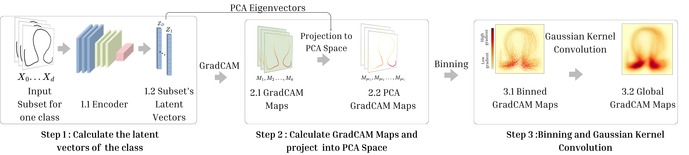
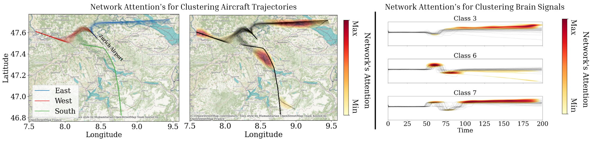
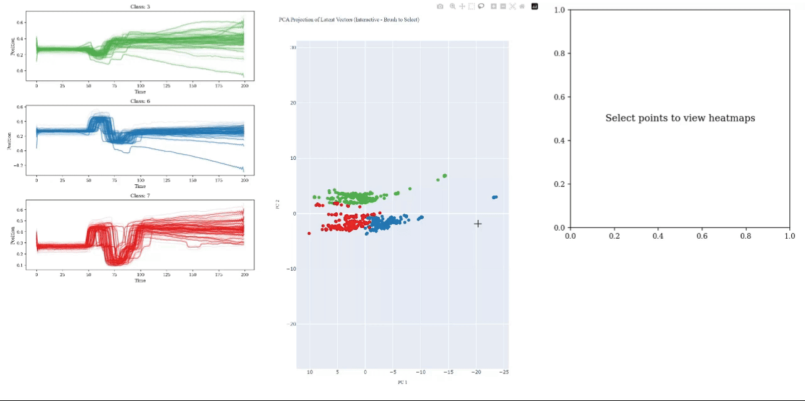
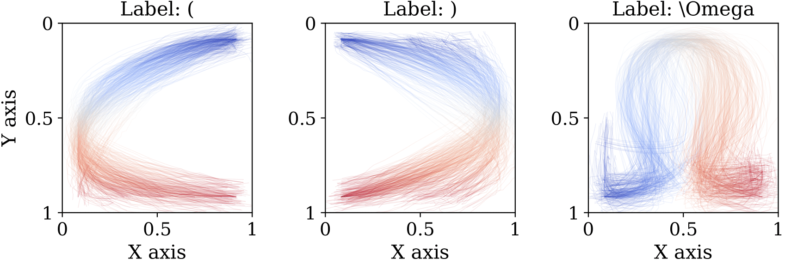
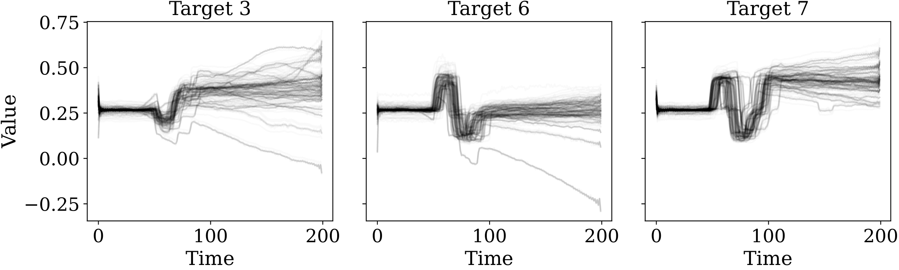
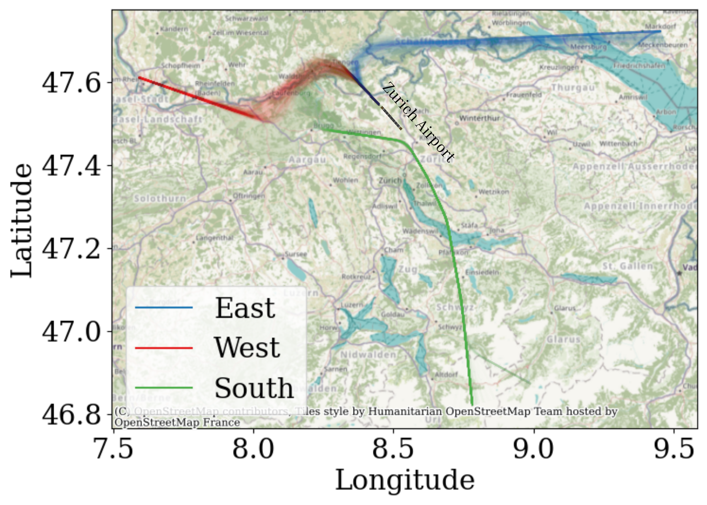

# Global Saliency Maps for Interpreting Autoencoders' Latent Directions for Time Series

**Zakaria Ezzahed**, **Xavier Olive**, **Christophe Hurter**  
Fédération ENAC ISAE-SUPAERO ONERA, Université de Toulouse, France  
ONERA – DTIS, Université de Toulouse, France  
Contact: {zakaria.ezzahed | christophe.hurter}@enac.fr, xavier.olive@onera.fr

---
 
*Figure: Methodologie's pipeline, combining GradCAM, PCA and Statistical binning to explain clustering in the latent space*

  

*Figure: Visualization of routes (left) and corresponding neural network attention maps (right) for landing trajectories (East, West, South)
near Zurich Airport. High attention regions indicate areas prioritized by the network for clustering.*

  

*Figure: Interactive brushing tool to explore the latent space of VAEs*

## 📚 Table of Contents

- [About the Project](#-about-the-project)
- [Citation](#-citation)
- [Getting Started](#-getting-started)
- [Repository Structure](#-repository-structure)
- [Datasets](#-datasets)
- [Pretrained Models](#-pretrained-models)


## 🧠 About the Project

This repository provides the official code and pretrained models for the paper:  
**_“Global Saliency Maps for Interpreting Autoencoders' Latent Directions for Time Series”_**

> **Abstract:**  
> Variational Autoencoders (VAEs) have demonstrated effectiveness across a wide range of machine learning tasks. Their ability to learn meaningful representations makes them particularly well-suited for time series applications, where uncovering latent structures is crucial for tasks such as anomaly detection, forecasting, and trajectory modeling.  
>
> However, the black-box nature of VAEs limits their interpretability, making it challenging to understand how specific input features influence the learned representations. Most existing methods focus on individual outputs or samples, failing to generalize across datasets.  
>
> To address this, we introduce a method to generate **global saliency maps** over entire time series datasets. By combining **GradCAM** with **PCA**-based latent space analysis, our method highlights the most influential input segments contributing to learned latent structures. The result is a global, interpretable view of the VAE’s behavior.  
>
> We validate the approach across three domains: **aircraft trajectories**, **EEG signals**, and **handwriting gestures**, demonstrating its robustness and versatility for explainable deep learning on sequential data.

---

## 📄 Citation

If you find this work useful, please consider citing the paper:

```bibtex
@article{ezzahed2024global,
  title={Global Saliency Maps For Interpreting Autoencoders' Latent Directions for Time Series},
  author={Ezzahed, Zakaria and Olive, Xavier and Hurter, Christophe},
  journal={},
  year={2024},
  volume={},
  pages={}
}
```

## 🚀 Getting Started

To reproduce our results or run the provided notebooks and experiments, we recommend using **Mamba**, a fast drop-in replacement for Conda.

### 1. Clone the Repository

```bash
git clone https://github.com/Aisthetic/explain_autoencoder.git
cd explain_autoencoder
```

### 2. Install Dependencies Using Mamba

Make sure you have [Mamba](https://mamba.readthedocs.io/en/latest/installation.html) installed. You can install it via Conda:

```bash
conda install mamba -n base -c conda-forge
```

Then create the environment from the `environment.yml` file:

```bash
mamba env create -f environment.yml
```

Activate the environment:

```bash
conda activate explain-autoencoder
```

> 🧪 The environment includes all necessary dependencies for running the notebooks, training the models, generating GradCAM explanations, and visualizing the global saliency maps.

### 3. Launch Jupyter Notebook

```bash
jupyter notebook
```

Navigate to the `experiments/` folder to explore and run specific analysis notebooks.

## 📁 Repository Structure

This repository is organized into the following main components:

### `models/`
Pretrained Variational Autoencoder (VAE) checkpoints for each dataset used in the experiments:
- `aircraft.ckpt`
<!-- - `aircraft-flyover.ckpt` -->
- `symbols.ckpt`
- `eog.ckpt`

These can be used to skip training and directly generate saliency maps or PCA plots.

---

### `explain/`
Core explainability module implementing:
- GradCAM for time series
- Guided backpropagation
- Trajectory pruning and saliency map generation

These scripts contain the main logic for generating local and global saliency maps, as introduced in the paper.

---

### `experiments/`
Notebook-based experiments structured by dataset:
- `symbols/`: Saliency + PCA analysis on handwritten trajectory data (e.g., parentheses, omega).
- `eog/`: EEG signal experiments, including an interactive brushing tool.
- `aircraft-flyover/`: Experiments comparing trained and untrained VAEs on flyover trajectories.
- `aircraft/`: Experiments on general aircraft trajectories.

Each folder contains reproducible Jupyter notebooks for generating figures and validating methods presented in the paper.

---

## 📂 Datasets

This repository supports experiments on three distinct time series datasets. Each dataset is stored under the `data/` directory and is preprocessed for direct use in the experiments.

| Dataset Name     | Folder Path         | Description                                                                 |
|------------------|---------------------|-----------------------------------------------------------------------------|
| **Symbols**      | `data/symbols/`     | Handwriting gesture data (e.g., `(`, `)`, `Ω`) represented as pen trajectories. |
| **EOG (EEG)**     | `data/eog/`         | Eye movement and EEG signal time series from physiological recordings.      |
| **Aircraft**      | `data/aircraft/`    | Real-world aircraft trajectories from general flight tracking.              |
| **Flyover**       | `data/aircraft_flyover/` | Filtered landing segments near Zurich Airport, grouped by direction (East, West, South). |

### 📸 Dataset Samples

  
*Symbols dataset: Handwriting gestures visualized as trajectories.*

  
*EOG dataset: Eye movement signals plotted over time.*

  
*Aircraft Flyover dataset: Arrival trajectories near LSZH Airport.*

### `deep_traffic_generation/`
This folder contains components adapted from [deep-traffic-generation](https://github.com/kruuZHAW/deep-traffic-generation-paper).  
Credit goes to the original authors for foundational model structures and preprocessing strategies.

## 🧠 Pretrained Models

The following pretrained VAE models are included in the `models/` directory. These checkpoints can be used to reproduce GradCAM heatmaps, PCA visualizations, and global saliency maps without retraining.

| File Name              | Description                                              | Dataset            |
|------------------------|----------------------------------------------------------|--------------------|
| `aircraft.ckpt`        | Trained VAE on general aircraft trajectory data          | Aircraft           |
| `aircraft-flyover.ckpt`| Trained VAE on flyover segments with distinct patterns   | Aircraft Flyover   |
| `symbols.ckpt`         | Trained VAE on handwritten symbol trajectory data        | Symbols (e.g. `(`, `)`, `Ω`) |
| `eog.ckpt`             | Trained VAE on EEG/EOG signal data                       | EOG (EEG)          |

📍 All models are ready-to-use. Simply load them into the relevant notebooks under `experiments/` to generate explanations and plots.

